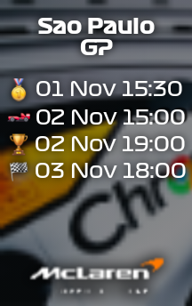

# F1 Widget
Android KWGT widget that displays the next upcoming Formula 1 race.

## API
The API provides the widget with all the session data and start times needed by the widget.

It acts like a small proxy between the widget and the source F1 Calendar JSON formatting the JSON so that it can easily be consumed by the widget

### Settings
The API has a single setting controlling which time zone to show the session times in.
The setting can be changed using environment variables.

| Name | Value |
| ---- | ----- |
| TZ   | TZ identifier taken from [List of tz database time zones](https://en.wikipedia.org/wiki/List_of_tz_database_time_zones) |

## Widgets


[Download](widgets/F1Widget_Mclaren_2024_Chrome.kwgt)

### Usage
TODO
- Import in KWGT
- Add new widget size 2x1

## Documentation

### Transformation steps
- Based on the current year we get the correct JSON from the F1 Calendar GitHub
- Order the races based on the FP1 start times
- Find the first race that has a session in the future
- Convert session times to configured time zone
- Format session times to fit on the widget

### Model
The widget requires a JSON model likes this:

```
{
  "race": {
    "location": "Sao Paulo",
    "fp1": "01 Nov 15:30",
    "fp2": null,
    "fp3": null,
    "qualifying": "02 Nov 19:00",
    "sprint": "02 Nov 15:00",
    "gp": "03 Nov 18:00"
  }
}
```

## Links
- [F1 Calendar](https://f1calendar.com/)
- [F1 Calendar GitHub](https://github.com/sportstimes/f1)
- [Kustom HQ](https://docs.kustom.rocks/)
- [KWGT](https://play.google.com/store/apps/details?id=org.kustom.widget&hl=nl)
- [Time zones](https://en.wikipedia.org/wiki/List_of_tz_database_time_zones)