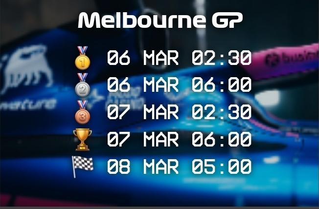
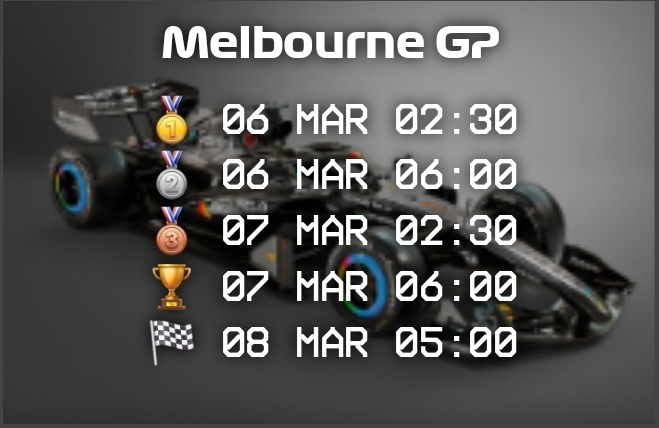
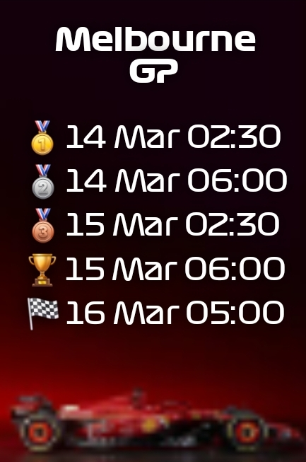
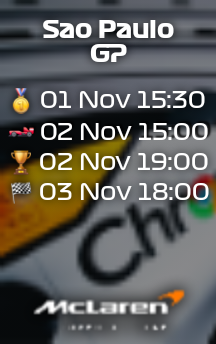

# 🏎️ F1 Widget
Android KWGT widget that displays the next upcoming Formula 1 race.

# 🌐 API
The API provides the widget with all the session data and start times needed by the widget.

It acts like a small proxy between the widget and the source F1 Calendar JSON formatting the JSON so that it can easily be consumed by the widget

## ⚙️ Settings
The API has a single setting controlling which time zone to show the session times in.
The setting can be changed using environment variables.

| Name | Value |
| ---- | ----- |
| TZ   | TZ identifier taken from [List of tz database time zones](https://en.wikipedia.org/wiki/List_of_tz_database_time_zones) |
| BASE_URL | Base Url where the api is hosted |

# 🖼️ Widgets

Click pictures to download the widget

## 2026

### 1x1
<a href="widgets/F1NextRace2026_Alpine.kwgt">Alpine</a>,
<a href="widgets/F1NextRace2026_Alpine2.kwgt">Alpine2</a>,
<a href="widgets/F1NextRace2026_Audi.kwgt">Audi</a>,
<a href="widgets/F1NextRace2026_Mercedes.kwgt">Mercedes</a>

### 2x1
<a href="widgets/F1NextRace2026_Alpine2_21.kwgt"></a>,
<a href="widgets/F1NextRace2026_McLaren_21.kwgt"></a>

## 2025
<a href="widgets/F1Widget_Ferrari_2025.kwgt"></a>

## 2024
<a href="widgets/F1Widget_Mclaren_2024_Chrome.kwgt"></a>

## Usage
1. Add a KWGT widget to your home screen.
2. Open KWGT, select Load Preset, and import the downloaded .kwgt file (skip if already in Kwgt/Kustom/widgets).


# 📄 Documentation

## Transformation steps

### Next race
- Based on the current year we get the correct JSON from the F1 Calendar GitHub
- Order the races based on the FP1 start times
- Find the first race that has a session in the future
- Convert session times to configured time zone
- Format session times to fit on the widget

### Circuit layout
- Based on the latitude and longitude of the next race find the matching circuit
- Based on the current year find the matching circuit layout
- Get the current layout svg url to display on the widget

## Model
The widget requires a JSON model likes this:

```
{
  "race": {
    "location": "Sao Paulo",
    "fp1": "01 Nov 15:30",
    "fp2": null,
    "fp3": null,
    "qualifying": "02 Nov 19:00",
    "sprint": "02 Nov 15:00",
    "gp": "03 Nov 18:00"
  },
  "circuit": {
    "layoutSvgUrl": "...",
    "layoutPngUrl": "..."
  }
}
```

# 🔗 Links
- [F1 Calendar](https://f1calendar.com/)
- [F1 Calendar GitHub](https://github.com/sportstimes/f1)
- [Kustom HQ](https://docs.kustom.rocks/)
- [KWGT](https://play.google.com/store/apps/details?id=org.kustom.widget&hl=nl)
- [Time zones](https://en.wikipedia.org/wiki/List_of_tz_database_time_zones)
- [Geolocation](https://github.com/scottschluer/geolocation)
- [SVG-NET](https://github.com/svg-net/SVG)
- [SVG-NET - Linux](https://svg-net.github.io/SVG/articles/GettingStarted.html#special-instructions-for-mac-and-linux)
- [Alpine GDI+](https://pkgs.alpinelinux.org/package/edge/community/x86/libgdiplus)